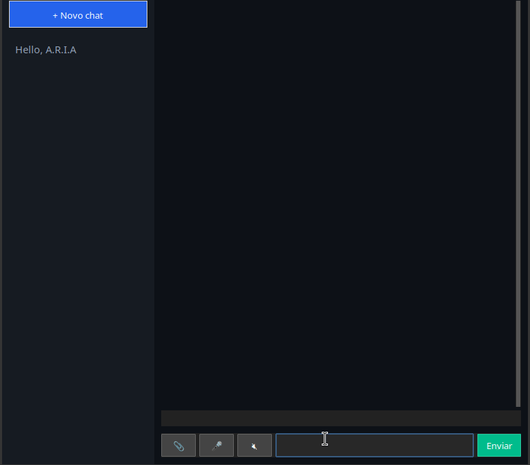

> 🇧🇷 Versão em português abaixo.

## Overview

A.R.I.A. (Automated Response & Instruction Assistant) is a local AI
assistant built in Python. It runs entirely on your own machine using
Ollama, with no paid API and no cloud dependency.

**Features**
- Local LLM chat with streaming responses
- Multiple chats with persistent long-term memory (saved as JSON)
- Voice input (push-to-talk, Whisper) and spoken replies (text-to-speech)
- Text file attachments (.txt, .md, .py, .csv, .json, .log, .yaml)
- Customizable personality via a simple config file
- Desktop interface built with ttkbootstrap

**Tech:** Python, Ollama, faster-whisper, pyttsx3, ttkbootstrap

**Status:** Core chat, voice and file features work. PDF/DOCX support,
tool permissions and intent routing are planned and scaffolded in the
project structure.

**Quick start:** see the Installation and Rodando sections below
(requires Python 3.10+ and Ollama).

# A.R.I.A. — Automated Response & Instruction Assistant

Assistente virtual local: conversa por texto e voz, anexo de arquivos,
memória de longo prazo e personalidade configurável. Tudo rodando na
sua máquina — sem cota, sem API paga, sem depender de nuvem.

## O que já funciona

- Chat local com IA via [Ollama](https://ollama.com) (sem API externa).
- Respostas em streaming (aparecem enquanto são geradas).
- Interface estilo ChatGPT: barra lateral com múltiplos chats, bolhas
  de mensagem selecionáveis/copiáveis.
- Memória de longo prazo: cada chat é salvo em `conversas/`, recarregado
  ao abrir o app. Renomear/apagar chats pelo clique direito na sidebar.
- Personalidade customizável em `core/persona.py` (texto livre).
- Anexo de múltiplos arquivos de texto (`.txt`, `.md`, `.py`, `.csv`,
  `.json`, `.log`, `.yaml`/`.yml`) por mensagem.
- Voz: push-to-talk (segura o botão 🎤 pra falar, solta pra transcrever)
  e leitura das respostas em voz alta (botão 🔊/🔇) — tudo local
  (Whisper via `faster-whisper` para STT, motor do sistema via
  `pyttsx3` para TTS).

## Em preparação (estrutura pronta, lógica ainda não implementada)

- `arquivos/`: só há handler de texto puro por enquanto. PDF, DOCX e
  planilhas vêm depois, cada um em seu próprio `*_handler.py`.
- `ferramentas/`: esqueleto da camada de permissões para automações
  futuras (nenhuma ferramenta real ainda).
- `core/agente.py`: reserva para a futura camada de roteamento de
  intenção (conversa vs. arquivo vs. ferramenta).

## Estrutura do projeto

```
aria_central/
├── main.py              # ponto de entrada
├── ui.py                # interface (ttkbootstrap)
├── core/
│   ├── config.py         # toda configuração em um só lugar (.env)
│   ├── persona.py        # personalidade / system prompt
│   ├── ai_client.py       # integração com o Ollama (streaming)
│   ├── memoria.py         # persistência de chats em JSON
│   └── agente.py          # reservado para o futuro roteador de intenção
├── arquivos/
│   ├── manager.py         # identifica o formato e chama o handler certo
│   └── txt_handler.py      # único handler implementado até agora
├── ferramentas/
│   └── permissoes.py      # esqueleto da camada de confirmação de ações
├── voz/
│   ├── captura.py          # grava o microfone (push-to-talk)
│   ├── reconhecimento.py   # Speech-to-Text (faster-whisper, local)
│   └── fala.py              # Text-to-Speech (pyttsx3, motor do SO)
├── conversas/              # dados — não versionado (.gitignore)
├── requirements.txt
└── .env.example
```

## Pré-requisitos

- Python 3.10+
- [Ollama](https://ollama.com) instalado e com um modelo baixado
  (`ollama pull llama3.2`)
- **Linux**: para a voz funcionar, instale as dependências de sistema
  antes do `pip install`:
  ```
  sudo apt install portaudio19-dev espeak-ng
  ```
  (`portaudio19-dev` é necessário pro `sounddevice` gravar o
  microfone; `espeak-ng` é o motor de voz que o `pyttsx3` usa no
  Linux.)

## Instalação

```bash
python3 -m venv venv
source venv/bin/activate      # Windows: venv\Scripts\activate
pip install -r requirements.txt
cp .env.example .env
```

Edite o `.env` se quiser trocar o modelo do Ollama, do Whisper, o
idioma, ou a velocidade da fala — tudo centralizado em `core/config.py`.

## Rodando

```bash
cd ~/aria_central
source venv/bin/activate
python main.py
```

Na primeira vez que você usar o microfone, o `faster-whisper` baixa o
modelo escolhido (padrão: `base`) — isso só acontece uma vez.

## Licença

Projeto pessoal — sem licença definida ainda.
